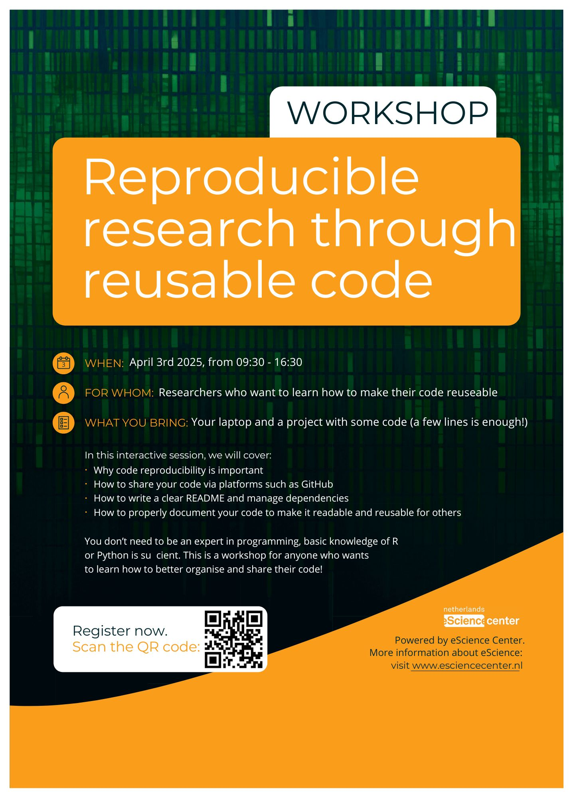
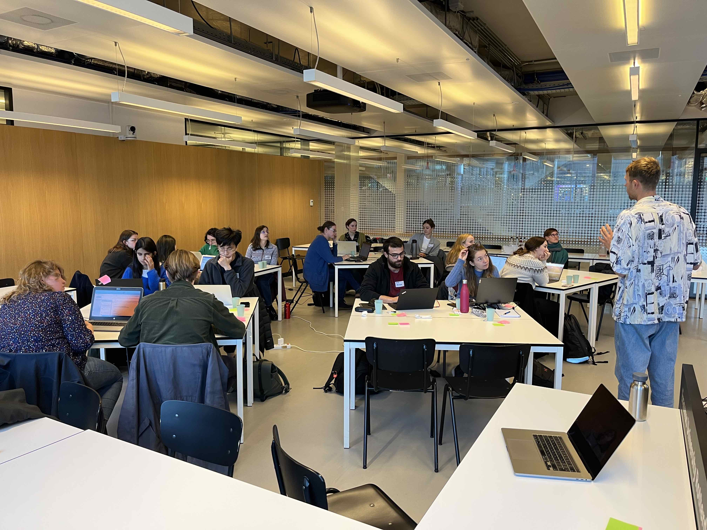
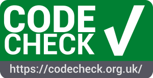

## *Reproducible research through reusable code* workshop

**April 3, 2025**

**Erasmus University Rotterdam**

Together with the [eScience Center](https://www.esciencecenter.nl/){target="_blank"}, we will host another hackathon-style workshop at ESSB about ***Reproducible research through reusable code***. This workshop will help you to learn all about reproducible research in practice!  

**--REGISTRATION IS NOW OPEN!--** 

You can find a [website here](https://esciencecenter-digital-skills.github.io/2025-04-03-repro-essb/){target="_blank"} with a workshop program and the option to register. PhD students at the Erasmus Graduate School for Social Sciences and the Humanities are eligible for [1.5 ECTS credit for participating in the workshop](https://www.eur.nl/en/egsh/course/reproducible-research-through-reusable-code){target="_blank"}!

{width=550}

#### Short recap of the first edition of the workshop
On 3 December 2024, we welcomed 16 participants, who worked on publishing and improving their own project in a day. At the end of the day, they had their code published on GitHub, with a README included, with explicitly documented software dependencies, and more improvements that made their code more reproducible and reusable. But most of all, we had fruitful exchanges about how to work more reproducible, and everyone went home with more tools in their toolbox to do so.   

The course materials are available at the [workshop website](https://carpentries-incubator.github.io/reproducible-research-through-reusable-code-in-1-day/){target="_blank"}: in case you are interested you can complete all the exercises yourself! 

{width=550}

## *CODECHECK-NL* workshop for Social and Behavioral Sciences

**Thursday November 28, 2024**

**Erasmus University Rotterdam**

[{width="207"}](https://codecheck.org.uk/){target="_blank"}

Together with the [CODECHECKing goes NL](https://www.nwo.nl/projecten/osf232063){target="_blank"} team, we hosted a CODECHECK workshop at Erasmus University Rotterdam. 

During this workshop, three authors got their code successfully checked by the other workshop partipants! The certificates can be found on Zenodo: one for a  [paper about accuracy of heart rate wearables](https://doi.org/10.5281/zenodo.14279041), one for a [paper about the use of wearables in a nursing home ](https://doi.org/10.5281/zenodo.14261193), and one for a [paper about calls for police services](https://doi.org/10.5281/zenodo.14278912).

More information about this specific workshop can be found on the [CODECHECK-NL](https://codecheck.org.uk/nl-workshop3/){target="_blank"} webpage! 

*Curious to know how it works? Read about the first [workshop in Delft](https://codecheck.org.uk/nl-workshop1/){target="_blank"}.*
