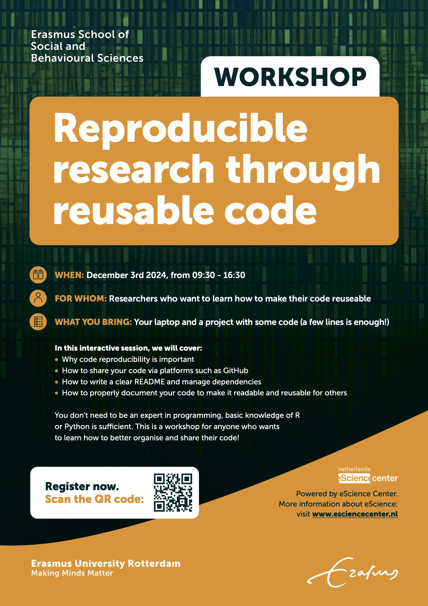

## *CODECHECK-NL* workshop for Social and Behavioral Sciences

**Thursday November 28, 2024**

**Erasmus University Rotterdam**

[{width="207"}](https://codecheck.org.uk/){target="_blank"}

Together with the [CODECHECKing goes NL](https://www.nwo.nl/projecten/osf232063){target="_blank"} team, we will host a CODECHECK workshop at Erasmus University Rotterdam. For this workshop, we are looking for researchers from the field of social and behavioral sciences based at a Dutch knowledge institution or university **who would like their papers or projects to be “codechecked”** during a live, one-day code-checking workshop on 28 November 2024.

The **call for papers is now open** on the [CODECHECK-NL](https://codecheck.org.uk/nl-workshop3/){target="_blank"} webpage! 

You can participate as a codechecker (i.e., a person reviewing code), or by submitting your own work to be checked (or both if you are up for it!). Note that PhD students at the Erasmus Graduate School for Social Sciences and the Humanities are eligible for [1.5 ECTS credit for participating in the workshop](https://www.eur.nl/en/egsh/course/code-check-your-research){target="_blank"}!

*Curious to know how it works? Read about the first [workshop in Delft](https://codecheck.org.uk/nl-workshop1/){target="_blank"}.*

## *Reproducible research through reusable code* workshop

**December 3, 2024**

**Erasmus University Rotterdam**

Together with the [eScience Center](https://www.esciencecenter.nl/){target="_blank"}, we will also host a workshop at ESSB about ***Reproducible research through reusable code*** that will help you to learn all about reproducible research in practice!

**----REGISTRATION IS NOW OPEN!----** 
You can find a [website here](https://esciencecenter-digital-skills.github.io/2024-12-03-repro-essb/){target="_blank"} with a preliminary workshop program and the option to register.
PhD students at the Erasmus Graduate School for Social Sciences and the Humanities are eligible for [1.5 ECTS credit for participating in the workshop](https://www.eur.nl/en/egsh/course/reproducible-research-through-reusable-code){target="_blank"}!

See also the flyer below:

{width=550}
